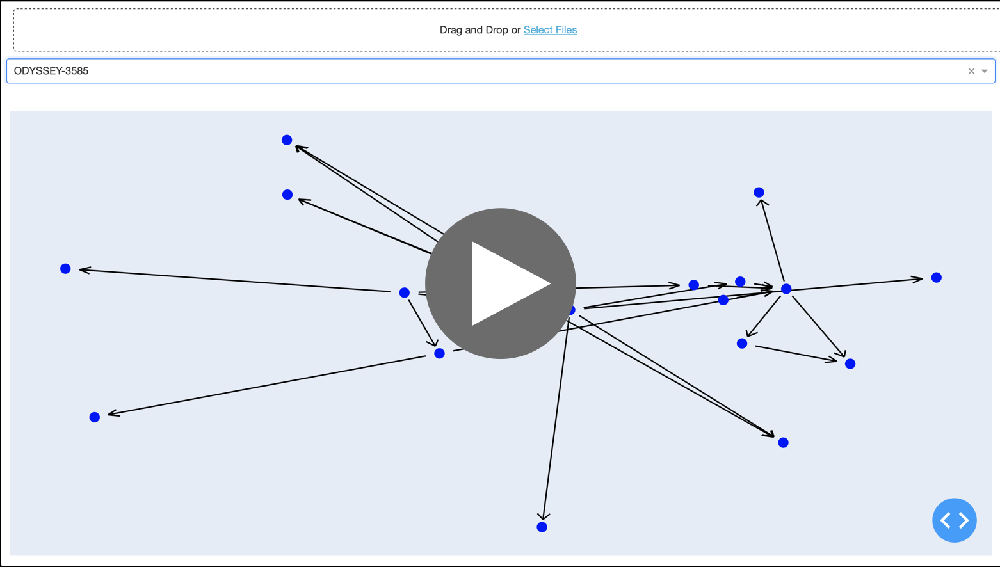

# Tasks visualizer

Visualize your tasks as a graphs.

To run this tool you need to have the following requirements:

- Have two files:
    - `nodes.csv` That have at least `Id` column with ids of your tasks. All the rest columns will be used as additional info in graph;
    - `edges.csv` must have two columns: `Source` and `Target`. Graph-jira will build graphs using these edges.
- Docker

Now you can run and use this app, simply run the following command: 

`docker run -it -p 8050:8050 kuparez/graph-jira:latest`

and go to http://locahost:8050 in your browser.
